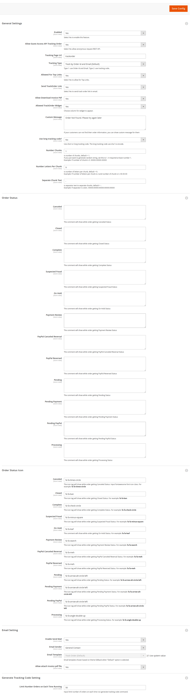

## How to installation

1. Setup module via FTP and run magento 2 commands:

The extension include 2 module: Ves_All and Ves_Trackorder

- Connect your server with FTP client (example: FileZilla).
- Upload module files in the module packages in to folder: app/code/Ves/Trackorder , app/code/Ves/All
- Access SSH terminal, then run commands:

```
php bin/magento setup:upgrade --keep-generated
php bin/magento setup:static-content:deploy -f
php bin/magento cache:clean
```
- To config the module please. Go to admin > Store > Configuration > Venustheme - Extensions > Track Order

Default module settings as this:
